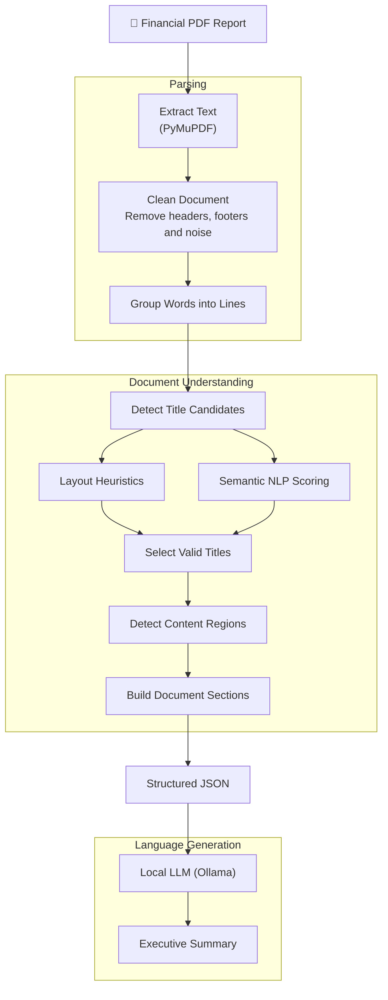

# Document Parsing Pipeline


   

PDF → Structured Sections → JSON → Executive Summary

A document parsing pipeline that extracts the structural hierarchy of financial PDF reports, identifies semantic sections through layout heuristics and NLP scoring, and produces structured data for high-quality LLM summarization.  

## Overview

Financial reports are among the most valuable sources of information for investors, analysts, and businesses. However, they are often lengthy, highly structured documents that require significant time to read, interpret, and analyze.

Although Large Language Models (LLMs) can assist in summarizing these reports, directly processing raw PDF text frequently leads to the loss of structural context. Headings, tables, page layouts, and document hierarchy are essential for understanding the information correctly, yet they are often discarded during text extraction.

This project addresses that challenge by introducing a document parsing pipeline that reconstructs the logical structure of financial reports before any interaction with an LLM. Using layout heuristics, typographic analysis, and NLP-based title scoring, the parser identifies document sections and generates a structured JSON representation of the report.

Instead of asking the LLM to understand an unstructured document, the parser provides a clean, hierarchical representation, allowing the language model to focus solely on generating accurate and context-aware executive summaries. The result is a pipeline that reduces information loss while helping transform lengthy financial documents into insights that can be consumed more efficiently.  

## Architecture

The parser separates document understanding from language generation.

Instead of relying on an LLM to infer the structure of a raw PDF, the pipeline first reconstructs the document hierarchy and organizes its content into structured sections. Only then is the resulting JSON passed to the language model for summarization.

## Architecture

The parser separates **document understanding** from **language generation**. Rather than relying on an LLM to infer document structure, the pipeline first reconstructs the logical hierarchy of the PDF and produces a structured JSON representation. Only then is the content passed to the language model for summarization.



## Installation

### 1. Clone the repository

```bash
git clone https://github.com/allvaret/Document_Parsing_Pipeline.git
cd Document_Parsing_Pipeline
```

### 2. Create a virtual environment

```bash
python -m venv .venv
```

Activate it:

**Windows**

```bash
.venv\Scripts\activate
```

**Linux / macOS**

```bash
source .venv/bin/activate
```

### 3. Install Python dependencies

```bash
pip install -r requirements.txt
```

### 4. Download the spaCy language model

```bash
python -m spacy download pt_core_news_md
```

### 5. Install Ollama

Download and install Ollama from the official website:

[https://ollama.com
](https://ollama.com/search)  
### 6. Download a language model

The project uses **Qwen2.5:3B** by default.

```bash
ollama pull qwen2.5:3b
```

You may use another compatible model by changing the model name in:

```text
src/LLM/client.py
```

## Quick Start

Place a financial PDF report inside the `assets/` directory.

By default, the project expects an input file defined in `src/main.py`:

```python
INPUT_FILE = "assets/example_report.pdf"
```

Run the application:

```bash
python src/main.py
```

The pipeline will:

1. Extract the document text.
2. Reconstruct its logical structure.
3. Generate a structured JSON representation.
4. Produce an executive summary using a local LLM.

Generated files are saved alongside the original document:

```text
example_report.pdf
example_report_sections.json
example_report_summary.json
```
## Project Structure

```text
financial-report-parsing-pipeline/
│
├── assets/                # Sample PDF reports and results
├── src/
│   ├── extractor/         # Parsing pipeline and section reconstruction
│   ├── llm/               # Local LLM client and prompt templates
│   ├── utils/             # Shared utilities and helper functions
│   └── main.py            # Application entry point
│
├── requirements.txt
├── pyproject.toml
└── README.md
```

The project is organized into three main components:

* **Extractor** — Responsible for document understanding, including text extraction, title detection, region detection, and section building.
* **LLM** — Handles communication with the local language model and prompt management.
* **Utils** — Provides reusable utilities shared across the parsing pipeline.

## Example Output

### Input

```text
assets/Earnings Release 3T25.pdf
```

### Generated Section

```json
{
    "title": "DRE Gerencial Trimestral",
    "page": 9,
    "confidence": "high",
    "content": [
      {
        "type": "table",
        "confidence": "high",
        "markdown": "| R$ milhões | 3T25 | 2T25 | 3T24 | 3T25 x 2T25 | 3T25 x 3T24 |\n"...
    ]
  }
}
```

### Executive Summary

```text
### Resumo Executivo

#### Período Principal: 9M25 vs 9M24

**RESULTADO DO PERÍODO**
- **Receita Total**: R$ 400,1 milhões (-8,5% em relação a 9M24)
- **Lucro Líquido**: R$ 130,5 milhões (-13,9% em relação a 9M24)
- **Margem Líquida**: 32,6% (de -2,0 pontos percentuais em relação a 9M24)

**PONTOS DE ATENÇÃO**
- A principal preocupação é a redução da atividade de M&A no período, que afetou negativamente as receitas e lucros...
...

```

## Technical Challenges

| Challenge                         | Solution                                                                                                           |
| --------------------------------- | ------------------------------------------------------------------------------------------------------------------ |
| **Recovering document structure** | Combined layout heuristics and typographic analysis to reconstruct the logical hierarchy of PDF reports.           |
| **Reliable title detection**      | Introduced a hybrid scoring approach that combines layout-based heuristics with NLP semantic scoring.              |
| **Repeated section titles**       | Implemented structural deduplication to remove recurring headers while preserving legitimate section titles.       |
| **Mixed document content**        | Distinguished narrative text from tabular regions before section reconstruction.                                   |
| **LLM context quality**           | Generated a structured JSON representation instead of sending raw PDF text, reducing noise and preserving context. |


## Roadmap

The current release focuses on building a robust document parsing pipeline capable of reconstructing the logical structure of financial reports before LLM summarization.

Future improvements include:

### Version 1.x

* Command-line interface (CLI)
* Improved logging and configuration
* Additional prompt templates
* Performance optimizations

### Version 2

* OCR support for scanned PDFs
* Enhanced table extraction
* Improved multi-column document parsing
* More robust section reconstruction

### Version 3

* Structured financial fact extraction
* Relevance ranking pipeline
* Knowledge-oriented JSON generation
* Multi-document analysis

## License

This project is licensed under the MIT License. See the [LICENSE](LICENSE) file for details.
